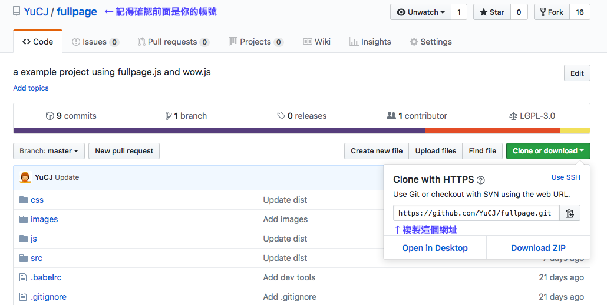
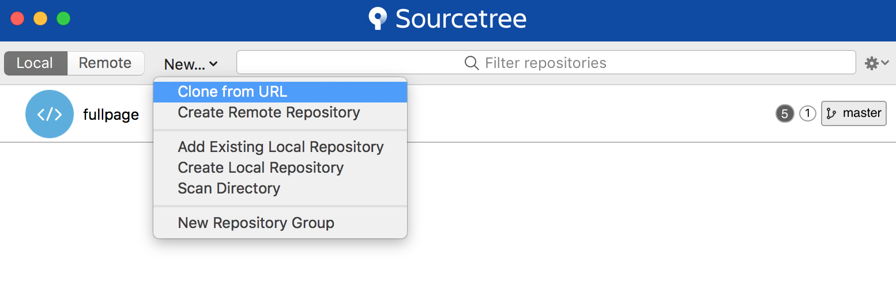
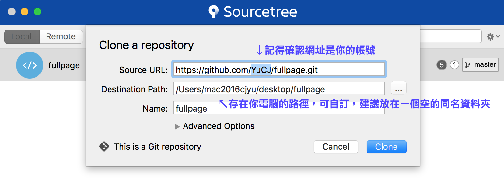
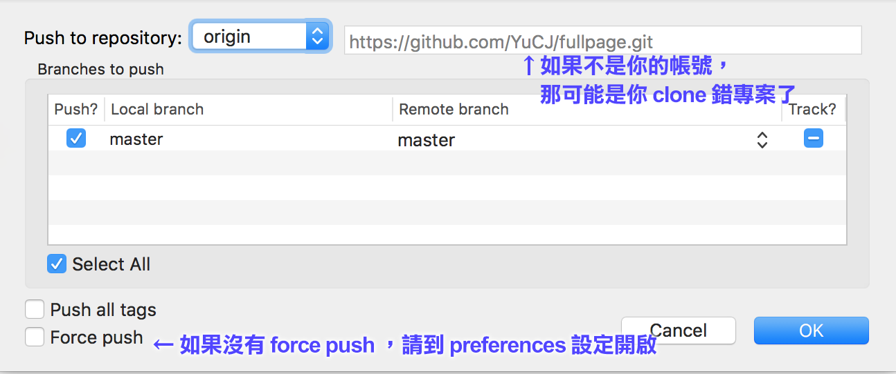

## 互動網頁製作軟體教學：Github 和 Sourcetree

## Git 是什麼？

就是一套管理專案「版本」的工具：

- 個人的版本控制
- 團隊的版本控制
- 專案的分支的版本控制

## Github 和 Sourcetree 介面簡介

名詞解釋

- **Repository**：一個專案（檔案資料夾）就是一個 repository，有時縮寫為 repo。存在網路上的平台的叫作 remote repo，存在你自己的電腦裡的叫作 local repo。
- **Commit**：一個 commit 是一個你手動提交的版本記錄，它裡面會記錄在這個版本裡，跟前一個版本比起來，改過了什麼東西
- **Branch**：分支，一個專案可以有很多不同的分支，就像遊戲分主線支線劇情一樣的概念。通常主線叫作 `master` （習慣）。
- **HEAD**：在軟體上可以看到會有一個 commti 會被標註 `HEAD`，這表示你電腦的 local repository 現在的進度被設定在這個 commit 。你可以把 `HEAD` 移到歷史記錄中任何一個 commit，Git 就會幫你把檔案都改變到那個狀態（時光機的概念）。
- **Github Page**：Github 提供的一個免費服務，可以把你存在他們的平台的靜態網頁程式碼（沒有後端程式）發佈給別人看。

動詞解釋

- **Commit**：就是提交一個 commit 的動作。
- **Fork**：把別人的專案 `fork` 一份到自己的帳號，就可以對自己的那份做修改。（注意授權）
- **Clone**：把自己在網路上的專案 `clone` 下來到自己的電腦，才能在電腦上編輯。（也可以 clone 別人的專案，但是你會沒有權限上傳回去更新）
- **Push**：把你電腦裡專案的某個 branch 上傳更新到你網路上的專案的某個 branch。
- **Pull**：Push 的相反，就是把網路上專案的某個 brach 下載回來更新自己電腦上的專案的某個 branch。不過實務上很少用。

延伸閱讀： [猴子也能懂的 Git 入門](https://backlog.com/git-tutorial/tw/intro/intro1_1.html)

課程只需要瞭解最單純的情況：

- 程式碼只作單線分支
- 雲端存一份版本記錄，你的電腦存一份版本記錄，還有你修改完但還沒存進版本記錄的檔案

## 操作步驟提示

### 怎麼從別人的 Github 帳號下載範例程式碼來修改？（使用 Github 介面 + Sourcetree 軟體）

（需要先註冊 Github 帳號和安裝 Sourcetree 軟體）

**第一步，fork**：

1. 到 Github 網站上 [我們的專案範例程式碼](https://github.com/YuCJ/fullpage)  頁面 `fork`  專案程式碼到你自己的帳號

註：同樣的帳號只能有一個同樣的專案，如果你想要重新 fork 一次範例檔案，請先到你的專案頁面 [Settings] → [Delete this repository]

**第二步，clone**：

1. 到**你自己的帳號**裡找存在雲端的程式碼網址
2. 透過 Sourcetree 軟體把程式碼 `clone` 下來你的電腦

註：clone 錯專案怎麼辦？把電腦上錯誤的資料夾刪除，重新 clone 一次就好了

### 要怎麼把做好的修改發佈到 Github 上面？（使用 Sourcetree 軟體）

（在你用編輯器做好檔案編輯修改，並**存檔**之後…）

**第一步，先新增 commit，儲存新的版本記錄**

1. 在 Sourcetree 軟體的左邊`[WorkSpace] -> [File Status]` 可以看到你現在有什麼檔案是修改過，但還沒有存到版本記錄
2. 把要存到版本紀錄的檔案通通打勾
3. 按左上角的 `commit +`，就新增一個版本存檔了！（可以在 `[WorkSpace] -> [History]` 看到結果）

**第二步，把新的 commit push 到 Github 你的帳號上面**

1. 點 Sourcetree 軟體上方工具列的 `Push ↑`
2. [Push to repository] 選 `origin` （後面網址就是你的專案在 Github 上的位置）
3. [Branches to push] ，把 local brach 和 remote branch 都選 `master` 並打勾
4. 點OK，可能會需要登入 Github，認證你有權限可以上傳到該專案
5. 上傳完成！

### 要怎麼復原到之前的版本？（Sourcetree）

1. 在 Sourcetree 軟體的左邊 `[WorkSpace] -> [History]` 找到你要復原到的版本紀錄點
2. 對他按右鍵 -> [Reset master to this commit]
3. 問你要選什麼復原模式 -> 選 [Hard - discard all working copy changes] ，也就是會放棄記錄點之後的所有變更
4. 會跳出警告說「確定要放棄全部變更」嗎？選 [OK]
5. 復原完成

註：使用復原功能後，如果要再更新到 Github 上面，在 `Push` 時的對話視窗要把 [Force Push] 打勾才可以。如果對話視窗沒有出現 [Force Push]，請到工作列 [Sourcetree] -> [Preferences] -> [Advanced] 把 [Allow Force Push] 打勾開啟。

### 怎麼用 Github Page 公開網頁？（Github）

1. 在你把範例程式碼 `fork` 到你自己的 Github Repositories 後，就可以到你的 Github 該 repo 頁面
2. 在專案頁面選 [Settings]
3. 滑到 [GitHub Pages] -> [Source] 選 master branch -> save
4. 上面就會出現你的專案發佈網址了！
5. 這個只要設定一次，以後你只要推新的程式碼版本到 `origin/master` branch，Github 就會自動幫你更新網頁

## VScode

- 介面簡介
- 開啟工作區
- 安裝plugin
- live server 使用
- 開發和快速鍵

