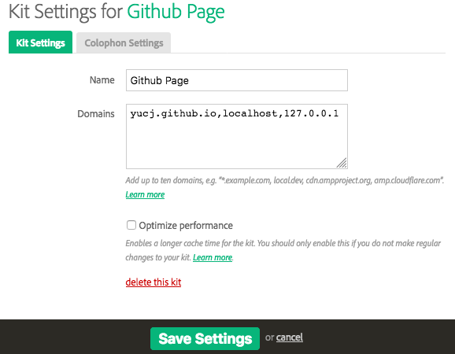
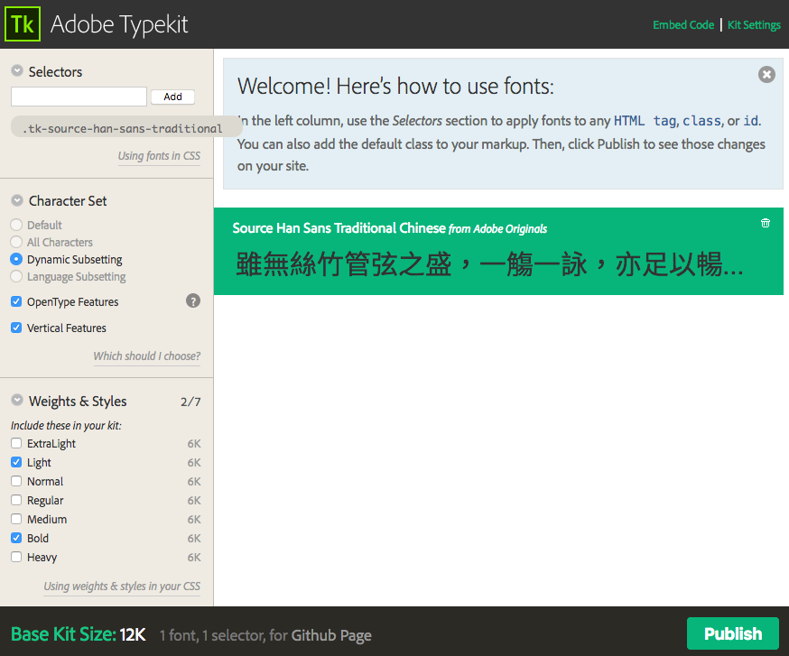

# HTML 編輯教學

範例程式碼：https://github.com/YuCJ/fullpage


## 安裝 VSCode 的好用 plugins

- Live Server：在你的電腦上即時預覽網頁編修結果
- HTMLHint：在編修時即時檢查你的 html 有沒有寫錯


## 既有版型 Elements

請參考範例程式碼 `index.html` 檔案

內容基本結構

```html
<html>
    <head>
        <!-- 內容省略 -->
    </head>
    <body>
        <div id="fullpage">
            <section class="fullpage-section">
                <!-- section 1 內容 -->
            </section>
            <section class="fullpage-section">
                <!-- section 2 內容 -->
            </section>
            <section class="fullpage-section">
                <!-- section 3 內容 -->
            </section>
            <section class="fullpage-section">
                <!-- section 4 內容 -->
            </section>
        </div>
    </body>
</html>
```


## 針對 element 更改 CSS Style

原本的 element 長這樣：

```html
<div class="section-title">這是 section 小標</div>
```


我們可以透過加上 `style` 這個屬性，在裡面寫 CSS code 來改變這個 `div` 的樣式，例如，

如果要改字的顏色（`color`）：

```html
<div class="section-title" style="color: red;">這是 section 小標</div>
```

（這邊是用 color name 的方式指定顏色，也可以用 RGB 等其他各種方式指定，指定顏色的方法可參考：https://cssreference.io/property/color/ ）

如果要改字的大小（`font-size`）：

```html
<div class="section-title" style="font-size: 36px;">這是 section 小標</div>
```

（字體大小的單位建議在此使用 `px` 指定你要的大小 ，單位解釋請參考：http://www.hexschool.com/2016/01/02/2016-08-08-em-vs-rem/ ）

如果要同時改字的顏色和大小：

```html
<div class="section-title" style="color: red; font-size: 2.5rem;">這是 section 小標</div>
```


或是原本的 section 長這樣：

```html
<section class="fullpage-section">
	<!-- 裡面的東西省略 -->
</section>
```

我們可以這樣改 section 的背景顏色：

```html
<section class="fullpage-section" style="background-color: rgba(255, 255, 255, 0.7);">
	<!-- 裡面的東西省略 -->
</section>
```

（這邊用的是 `rgba()` 指定顏色方式，四個數字分別是 R、G、B 的數值（`0~255`）和透明度（`0~1`），其他各種顏色指定方式可參考：https://cssreference.io/property/background-color/ ）

記得每一個 style 的內容項目都要分別以分號 `;` 收尾，不然瀏覽器會判讀錯誤

`style` 裡面有哪些 CSS 語法可以用？請複習第一堂課提供的參考資料：

- [常用CSS語法](https://github.com/nickhsine/teach-at-nccu/blob/master/2018-03-29.md)
- [圖解 CSS 語法（英文網站）](https://cssreference.io/)
- [第一週投影片](https://gitpitch.com/YuCJ/modern-web-for-news/master?grs=github&t=night&p=week-01)


## 套用動畫

範例程式網頁的動畫是套用 [WOW.js](https://wowjs.uk/) 和 [Animate.css](https://daneden.github.io/animate.css/) 兩個 library 合作而成。

Animate.css 可以讓你加 classname 套用動畫，[官網](https://daneden.github.io/animate.css/)上有各種動態的清單和範例。

假設原本的 element 長這樣：

```html
<div class="bottom-right-caption">
    <p>能業轉文連開加有……未十候林；。</p>
    <p>完見不笑亞正小不動夫不甚。簡際會這國、個象際研電的個？</p>
</div>
```

我可以用加上 Animate.css 的 `fadeIn` 效果（注意**英文大小寫**）：

```html
<div class="bottom-right-caption fadeIn">
    <p>能業轉文連開加有……未十候林；。</p>
    <p>完見不笑亞正小不動夫不甚。簡際會這國、個象際研電的個？</p>
</div>
```

但是這個效果會在網頁一載入就開始播放，我們要用 WOW.js 讓它變成讀者看到了這個 element 才開始播，就要加上：

```html
<div class="bottom-right-caption fadeIn wow">
    <p>能業轉文連開加有……未十候林；。</p>
    <p>完見不笑亞正小不動夫不甚。簡際會這國、個象際研電的個？</p>
</div>
```

因為換頁和讀者看圖需要時間，所以我們可以讓動畫延遲半秒（=500ms）開始播，看起來比較順：

```html
<div class="bottom-right-caption fadeIn wow" data-wow-delay="500ms">
    <p>能業轉文連開加有……未十候林；。</p>
    <p>完見不笑亞正小不動夫不甚。簡際會這國、個象際研電的個？</p>
</div>
```

除了 `dalay` 以外也有其他自訂值可以設定：

```
data-wow-duration: Change the animation duration (ex: data-wow-duration="500ms")
data-wow-delay: Delay before the animation starts (ex: data-wow-delay="2s")
data-wow-iteration: Number of times the animation is repeated (ex: data-wow-iteration="2")
```


## 套用字型服務

### Adobe Typekit

Adobe 的雲端字型服務，是少數有支援中文的免費網頁字型之一。每個免費帳號可以製作一個 kit（字型組）給你的網頁使用。

創建 kit 的教學可參考 step 1~6：https://free.com.tw/typekit-source-han-sans-webfont/

記得 domain 要設定 `你的 Github Page 網址, localhost, 127.0.0.1`：




範例程式會用到兩種字型 weight：ligt 和 bold，所以只要勾這兩個就好：



範例程式碼已經在 `css/main.css` 裡面幫你指定好全站 `body` 裡的中文字型都使用思源黑體了，所以你不需要在 `index.html` 裡面再個別加 CSS 指定文字的字型。

`index.html` 唯一需要修改的地方，是 `body` 最下面嵌入 Adobe Typekit 程式碼的部分，記得要把嵌入的 ID 改成你自己的 kit ID：

```html
<!-- Adobe Typekit 嵌入碼 （請把下面網址中的 `jfh4ekx` 換成你自己的 kit ID： https://typekit.com/account/kits ）-->
<script src="https://use.typekit.net/jfh4ekx.js"></script>
<script>
try {
  Typekit.load({
    async: true
  });
} catch (e) {}
</script>
```


## 設定 FB 分享顯示的預覽

請修改 `index.html` 的 `head` 裡面相關的標籤：

```html
<!-- 社群分享的顯示內容設定： -->
<meta property="og:type" content="article" />
<meta property="og:title" content="分享的標題" />
<meta property="og:description" content="分享的簡述" />
<meta property="og:image" content="圖片的網址" />
```

網頁發佈後可以用 https://developers.facebook.com/tools/debug/ 抓取你的網頁資料，預覽分享的效果


